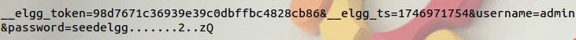
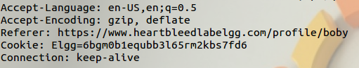
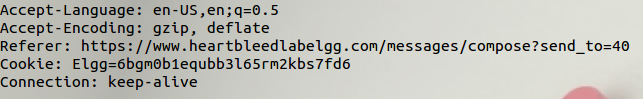
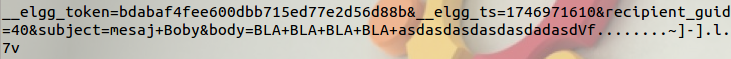
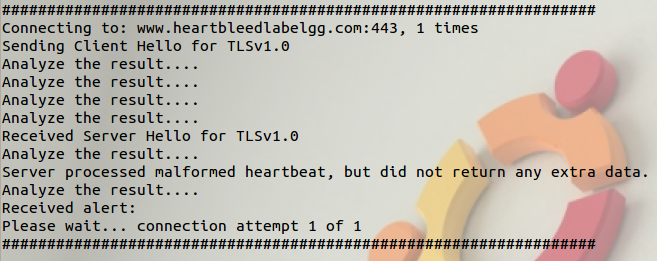
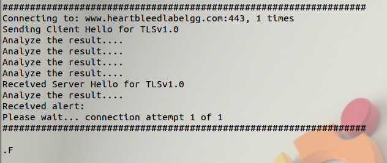

# lab2

## Heartbleed Attack Lab

**Task 1: Launch the Heartbleed Attack**

- User name and password.  
  
- User’s activity (what the user has done).  
  
  
  
- The exact content of the private message.  
  

**Task 2: Find the Cause of the Heartbleed Vulnerability**

- Question 2.1: As the length variable decreases, what kind of difference can you observe?
  - Answer: The response packet contains less and less data from the server.
- Question 2.2: Please find that boundary length.
  - Answer:  
    

**Task 3: Countermeasure and Bug Fix**

- Task 3.1: Try your attack again after you have updated the OpenSSL library. Please describe your observations.
  - Answer:  
    
- Task 3.2: The objective of this task is to figure out how to fix the Heartbleed bug in the source code.
  - Answer: Alice is right: "Alice thinks the fundamental cause is missing the boundary checking during the buffer copy." We have to make sure that the length of the request matches the actual length.
