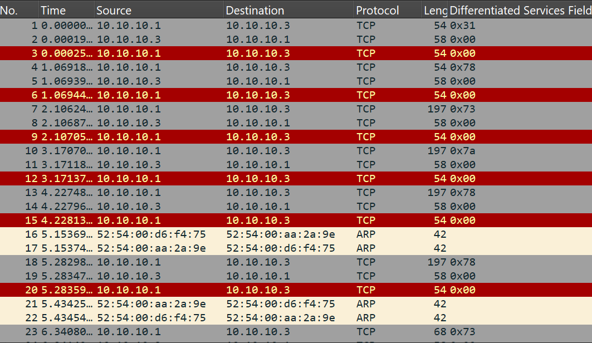

# lab3

By looking in the "Differentiated Services Field", in the Internet Protocol, we can see multiple hex values (I have added this field as a column to be easier to visualize).



If we try to convert those values to ASCII we get the string we were looking for `1xszxxssx*vx*`.

```python
>>> chr(0x31)
'1'
>>> chr(0x78)
'x'
>>> chr(0x73)
's'
>>> chr(0x7a)
'z'
>>> chr(0x78)
'x'
>>> chr(0x78)
'x'
>>> chr(0x73)
's'
```

To extract only the useful data from Wireshark, I applied the following filter `(ip.src == 10.10.10.1) && (tcp.seq == 0)` and then used "Extract Packet Dissections" to extract it as a csv.

After running `main.py` we find that the string is `1xszxxssx*vx*pr|}!(/.p(,%|||'x|v'-()sr}.t}*r|x)q{."(wr*{z'zx4`.

```python
import pandas as pd

df = pd.read_csv("packetz.csv")

text = ""
for i in range(len(df["Differentiated Services Field"])):
    text += bytes.fromhex(df["Differentiated Services Field"][i][2:]).decode("utf-8")

print(text)
```

Using `strings` over the traffic capture reveals this:

```
PS \fmi-unibuc-master\Year I\Semester 2\network-security\Laborator\lab3> strings .\packetz.pcapng
Intel(R) Core(TM) i7-8550U CPU @ 1.80GHz (with SSE4.2)
Linux 5.5.15-200.fc31.x86_64
Dumpcap (Wireshark) 3.2.0 (Git commit e0ed4cfa3d72)
virbr1
Linux 5.5.15-200.fc31.x86_64
Nothing here.Nothing here.Nothing here.Nothing here.Nothing here.Nothing here.Nothing here.Nothing here.Nothing here.Nothing here.Nothing here.
tmN9
Nothing here.Nothing here.Nothing here.Nothing here.Nothing here.Nothing here.Nothing here.Nothing here.Nothing here.Nothing here.Nothing here.
Nothing here.Nothing here.Nothing here.Nothing here.Nothing here.Nothing here.Nothing here.Nothing here.Nothing here.Nothing here.Nothing here.
Nothing here.Nothing here.Nothing here.Nothing here.Nothing here.Nothing here.Nothing here.Nothing here.Nothing here.Nothing here.Nothing here.
No luck today.d
p{}5Y
Just quit. You are not that good :)
La lalala la la la la lalalalalaaaaaa la la la la la lalala la la la la lalalalalaaaaaa la la la la
o&u6
Don't look in this. Is garbage. 795b6904e54f82411df4b0e27a373a55eea3f9d66dac5a9bce1dd92f7b401da5
No luck today.d
Just watch some TV and relax.
In cryptography, a cipher (or cypher) is an algorithm for performing encryption or decryption
a series of well-defined steps that can be followed as a procedure. An alternative, less common term is encipherment. To encipher or encode is to convert information into cipher or code. In common parlance, cipher is synonymous with code, as they are both a set of steps that encrypt a message; however, the concepts are distinct in cryptography, especially classical cryptography.
Just quit. You are not that good :)
No luck today.d
Just quit. You are not that good :)
pz+:
La lalala la la la la lalalalalaaaaaa la la la la la lalala la la la la lalalalalaaaaaa la la la la
La lalala la la la la lalalalalaaaaaa la la la la la lalala la la la la lalalalalaaaaaa la la la la
La lalala la la la la lalalalalaaaaaa la la la la la lalala la la la la lalalalalaaaaaa la la la la
La lalala la la la la lalalalalaaaaaa la la la la la lalala la la la la lalalalalaaaaaa la la la la
y@&:
Nothing here.Nothing here.Nothing here.Nothing here.Nothing here.Nothing here.Nothing here.Nothing here.Nothing here.Nothing here.Nothing here.
Nothing here.Nothing here.Nothing here.Nothing here.Nothing here.Nothing here.Nothing here.Nothing here.Nothing here.Nothing here.Nothing here.
La lalala la la la la lalalalalaaaaaa la la la la la lalala la la la la lalalalalaaaaaa la la la la
La lalala la la la la lalalalalaaaaaa la la la la la lalala la la la la lalalalalaaaaaa la la la la
$1A!6
Just quit. You are not that good :)
Just quit. You are not that good :)
No luck today.d
Just watch some TV and relax.
Don't bother with this problem.
No luck today.d
Don't look in this. Is another garbage. 3fa065b389c467810b6c609384b7709d8a28d54ff3ee247708020f9b39c058ec
7 CP
In cryptography, a cipher (or cypher) is an algorithm for performing encryption or decryption
a series of well-defined steps that can be followed as a procedure. An alternative, less common term is encipherment. To encipher or encode is to convert information into cipher or code. In common parlance, cipher is synonymous with code, as they are both a set of steps that encrypt a message; however, the concepts are distinct in cryptography, especially classical cryptography.
7 CQ`
7 CQ
La lalala la la la la lalalalalaaaaaa la la la la la lalala la la la la lalalalalaaaaaa la la la la
Nothing here.Nothing here.Nothing here.Nothing here.Nothing here.Nothing here.Nothing here.Nothing here.Nothing here.Nothing here.Nothing here.
Just quit. You are not that good :)
Just watch some TV and relax.
Don't look in this. Same old garbage. 795b6904e54f82411df4b0e27a373a55eea3f9d66dac5a9bce1dd92f7b401da5
Democleitus: Hello Cleoxenus!
Cleoxenus: Hello Democleitus!
Democleitus: We need to set a key for the them.
q)O`
e1PU
Cleoxenus: Good. We do classic?
Democleitus: Yes, but with a twist :)
Cleoxenus: OK. Here is the key: LOCK.
Democleitus: Got it.
bzKE
Cleoxenus: Bye.
Democleitus: Bye.
Nothing here.Nothing here.Nothing here.Nothing here.Nothing here.Nothing here.Nothing here.Nothing here.Nothing here.Nothing here.Nothing here.
Nothing here.Nothing here.Nothing here.Nothing here.Nothing here.Nothing here.Nothing here.Nothing here.Nothing here.Nothing here.Nothing here.
Nothing here.Nothing here.Nothing here.Nothing here.Nothing here.Nothing here.Nothing here.Nothing here.Nothing here.Nothing here.Nothing here.
Nothing here.Nothing here.Nothing here.Nothing here.Nothing here.Nothing here.Nothing here.Nothing here.Nothing here.Nothing here.Nothing here.
No luck today.d
LNPC:
Just quit. You are not that good :)
La lalala la la la la lalalalalaaaaaa la la la la la lalala la la la la lalalalalaaaaaa la la la la
Don't look in this. Is garbage. 795b6904e54f82411df4b0e27a373a55eea3f9d66dac5a9bce1dd92f7b401da5
No luck today.d
TUt`
Just watch some TV and relax.
In cryptography, a cipher (or cypher) is an algorithm for performing encryption or decryption
a series of well-defined steps that can be followed as a procedure. An alternative, less common term is encipherment. To encipher or encode is to convert information into cipher or code. In common parlance, cipher is synonymous with code, as they are both a set of steps that encrypt a message; however, the concepts are distinct in cryptography, especially classical cryptography.
Just quit. You are not that good :)
No luck today.d
Just quit. You are not that good :)
La lalala la la la la lalalalalaaaaaa la la la la la lalala la la la la lalalalalaaaaaa la la la la
La lalala la la la la lalalalalaaaaaa la la la la la lalala la la la la lalalalalaaaaaa la la la la
La lalala la la la la lalalalalaaaaaa la la la la la lalala la la la la lalalalalaaaaaa la la la la
La lalala la la la la lalalalalaaaaaa la la la la la lalala la la la la lalalalalaaaaaa la la la la
Nothing here.Nothing here.Nothing here.Nothing here.Nothing here.Nothing here.Nothing here.Nothing here.Nothing here.Nothing here.Nothing here.
Nothing here.Nothing here.Nothing here.Nothing here.Nothing here.Nothing here.Nothing here.Nothing here.Nothing here.Nothing here.Nothing here.
La lalala la la la la lalalalalaaaaaa la la la la la lalala la la la la lalalalalaaaaaa la la la la
La lalala la la la la lalalalalaaaaaa la la la la la lalala la la la la lalalalalaaaaaa la la la la
Counters provided by dumpcap
```

There are some sha256 hashes but they dont decrypt into anything useful.

```
795b6904e54f82411df4b0e27a373a55eea3f9d66dac5a9bce1dd92f7b401da5 -> garbage
3fa065b389c467810b6c609384b7709d8a28d54ff3ee247708020f9b39c058ec -> doesn't decrypt?
```

In the text there is a conversation between Democleitus and Cleoxenus where they talk about some key `LOCK`.

After trying to XOR a few hex values I find that the first hex value might the the last character from the flag.

```python
>>> chr(0x31 ^ ord('L'))
'}'
>>> chr(0x31 ^ ord('O'))
'~'
>>> chr(0x31 ^ ord('C'))
'r'
>>> chr(0x31 ^ ord('K'))
'z'
```

So now I try to go start from the end to XOR. I am expecting to find "E" and "C" since the flag has this format: "ECSC{...}".

```python
>>> chr(0x0a ^ ord('L'))
'F'
>>> chr(0x0a ^ ord('O'))
'E'
>>> chr(0x0a ^ ord('C'))
'I'
>>> chr(0x0a ^ ord('K'))
'A'
>>> chr(0x0f ^ ord('L'))
'C'
>>> chr(0x0f ^ ord('O'))
'@'
>>> chr(0x0f ^ ord('C'))
'L'
>>> chr(0x0f ^ ord('K'))
'D'
```

I see that "E" is found using "O" and then "C" is found by using "L". I keep goint the find the first few characters that I am sure they are in the flag (`ECSC{`).

```python
>>> chr(0x0a ^ ord('O'))
'E'
>>> chr(0x0f ^ ord('L'))
'C'
>>> chr(0x18 ^ ord('K'))
'S'
>>> chr(0x00 ^ ord('C'))
'C'
>>> chr(0x34 ^ ord('O'))
'{'
```

We can see a pattern of repeating `OLKC`. We then write a python script (`main.py`) to XOR every hex value in reverse order using this cylclic sequence `OLKC`.

```python
import pandas as pd

df = pd.read_csv("packetz.csv")

flag = ""
key = "OLKC" * 17 + "OL"
for i in range(len(df["Differentiated Services Field"])):
    flag += chr(
        int(
            df["Differentiated Services Field"][
                len(df["Differentiated Services Field"]) - i - 1
            ],
            0,
        )
        ^ ord(key[i])
    )

print(flag)
```

The flag is written in the sha256 format.
`ECSC{41d57a183ca0b02f471e367a190fdfd903d307fcd43accb20930f35e48074107`
